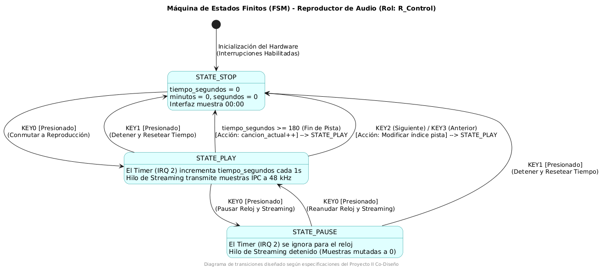
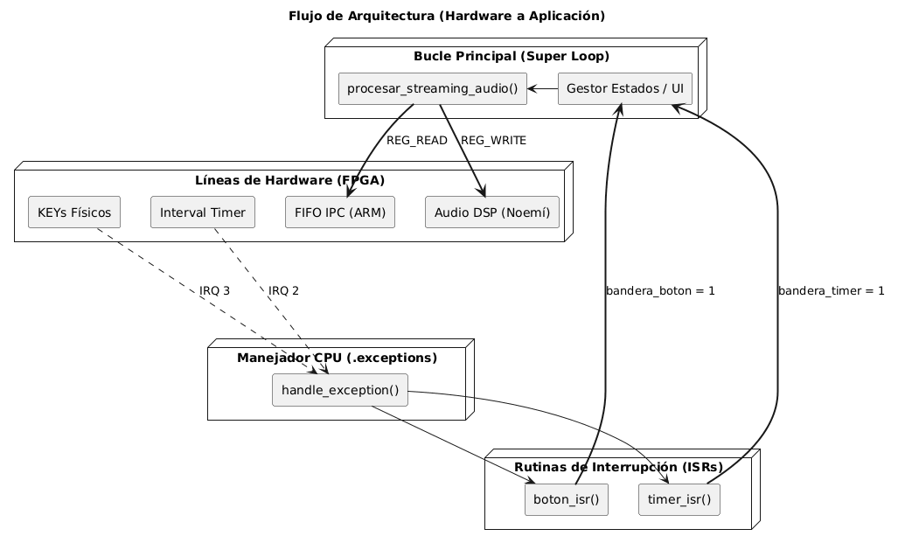

# Documentación Técnica de Firmware Bare Metal


## Gestión de Estado, Interfaz y Streaming IPC

Este documento detalla el diseño arquitectónico, el comportamiento lógico y la implementación del software de control ejecutado de manera nativa (*Bare Metal*) en el procesador soft-core **Nios II** de la FPGA Intel DE1-SoC.

---

## 1. Diseño Lógico del Sistema (FSM)

El comportamiento secuencial del reproductor de audio está gobernado por una Máquina de Estados Finitos (FSM) síncrona. Esta estructura garantiza transiciones seguras entre los estados operativos, impidiendo que el flujo de audio se corrompa al interactuar con los periféricos físicos.

### Estados Principales
* **`STATE_STOP`**: Estado inicial y de reseteo. El contador temporal se limpia en cascada (`00:00`) y el flujo de streaming permanece inactivo enviando muestras nulas (silencio).
* **`STATE_PLAY`**: Estado activo de reproducción. El temporizador por hardware (`Interval Timer`) incrementa el contador de segundos de manera determinista y se habilita el lazo de extracción de muestras de la FIFO IPC.
* **`STATE_PAUSE`**: Estado de congelamiento operativo. El contador de tiempo detiene su avance y el lazo de streaming muta las muestras dinámicas hacia cero para pausar el audio sin perder la sincronización con el bus del ARM.

### Diagrama de la Máquina de Estados
El siguiente diagrama ilustra las transiciones provocadas por los pulsadores físicos (`KEY0` a `KEY3`) y las condiciones de seguridad automáticas:



---

## 2. Arquitectura de Software y Gestión de Interrupciones

Para cumplir de manera estricta con la restricción **REQ-16 (No HAL)**, el sistema prescinde de cualquier capa de abstracción provista por las herramientas de Altera. Toda la gestión de excepciones y control de periféricos se realiza mediante manipulación directa de punteros asignados en memoria y registros de control nativos de la CPU Nios II.

### Flujo de Excepciones Asíncronas
1.  **Estímulo Físico**: Al recibir un flanco de bajada mecánico en los pulsadores (`IRQ 3`) o un fin de conteo del temporizador (`IRQ 2`), la CPU desvía su flujo hacia la dirección fija de excepciones.
2.  **Vector Genérico (`handle_exception`)**: Ubicado explícitamente en la sección de memoria `.exceptions`. Almacena el contexto en la pila, lee el registro `ctl4` (`ipending`) utilizando instrucciones intrínsecas de ensamblador, e identifica de forma determinista la fuente de la interrupción.
3.  **Rutinas de Servicio (ISRs)**: 
    * `timer_isr`: Limpia el flag de hardware y actualiza el formato temporal de la pista (`MM:SS`).
    * `boton_isr`: Lee y limpia el registro `EDGE_CAPTURE` de las líneas PIO y gestiona el debounce de seguridad.

### Diagrama de Bloques Arquitectónico
El flujo de datos e interrupciones desde las capas físicas de la FPGA hasta el bucle principal de la aplicación se estructura de la siguiente forma:



---

## 3. Algoritmo de Streaming Inter-Procesador (IPC)

El núcleo operativo del software es la función `procesar_streaming_audio()`, encargada de acoplar el flujo de datos proveniente del procesador ARM HPS con la IP de filtrado y conversión digital de audio instalada en la tela de la FPGA.

Para cumplir con el requerimiento **REQ-17 (Sincronización IPC)** de manera eficiente y no bloqueante, el lazo principal ejecuta una **doble validación de banderas por hardware**:

```c
// Pseudocódigo del lazo de streaming síncronizado en el Super Loop
void procesar_streaming_audio(void) {
    // 1. Verificar si el procesador ARM ha depositado datos en la FIFO IPC
    uint32_t muestras_en_fifo = REG_READ(FIFO_OUT_CSR_BASE, FIFO_LEVEL_REG);
    
    if (muestras_en_fifo > 0) {
        // 2. Verificar si la IP de Audio (DSP) tiene espacio libre en su buffer
        uint32_t dsp_status = REG_READ(AUDIO_SAMPLE_INPUT_BASE, SAMPLE_STATUS_OFFSET);
        
        if (!(dsp_status & SAMPLE_STATUS_FIFO_FULL)) {
            // 3. Extracción y despaquetado síncrono (16-bit Signed PCM)
            uint32_t muestra_ipc = REG_READ(FIFO_OUT_BASE, FIFO_DATA_OFFSET);
            int16_t muestra_audio = (int16_t)(muestra_ipc & 0xFFFF);
            
            // 4. Despacho directo al bloque de hardware del filtro
            REG_WRITE(AUDIO_SAMPLE_INPUT_BASE, SAMPLE_WRITE_OFFSET, muestra_audio);
        }
    }
}
```

Este algoritmo de escrutinio directo (polling optimizado) toma únicamente un par de ciclos de reloj por iteración, manteniendo la CPU libre para atender las interrupciones del usuario y garantizando una tasa de transferencia estable a 48 kHz sin provocar degradación en la calidad sonora (*underflow*).